# 쇼핑몰

# 서비스 시나리오

기능적 요구사항
1. 고객이 메뉴를 선택하여 주문한다
1. 주문이 되면 결제 한다
1. 주문하면 재고 내역에서 수량을 감소시킨다
1. 결제가 완료되면 배송을 시작한다
1. 고객이 주문을 취소할 수 있다
1. 결제를 취소하면 배송을 취소한다
1. 결제를 취소하면 재고 내역에서 수량을 증가시킨다
1. 재고담당자는 재고를 추가할수있다


## 클라우드 아키텍처 설계
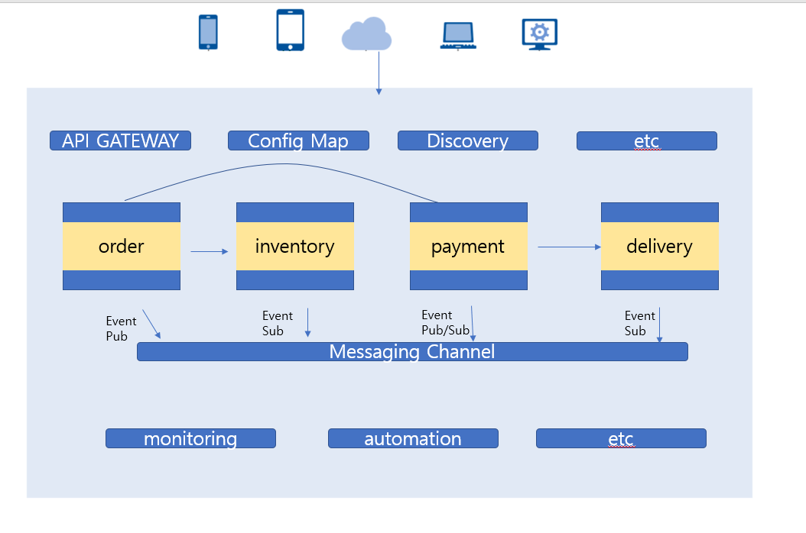

## 이벤트 스토밍
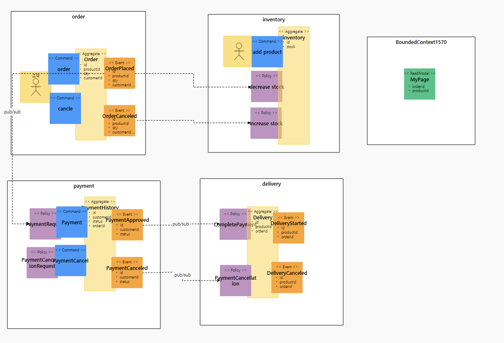

# 개발
--------------------------------------------------------------------------------------

### 분산트랜잭션 - saga

- 초기 재고량 설정

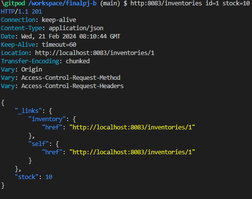

- 주문

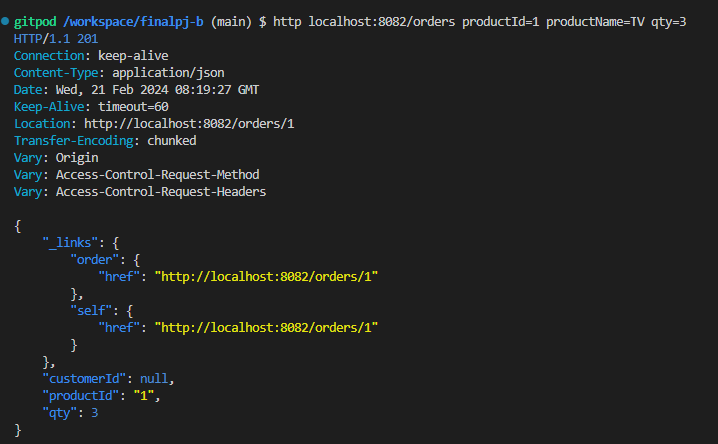

- kafka 확인

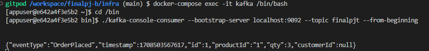

- 재고변화 확인

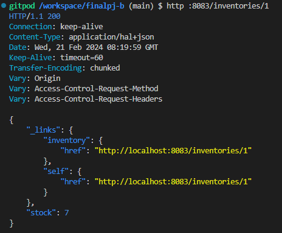

### 보상처리

- 주문취소 kafka 확인

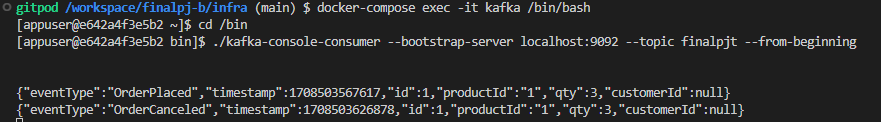

- 재고 변화 확인

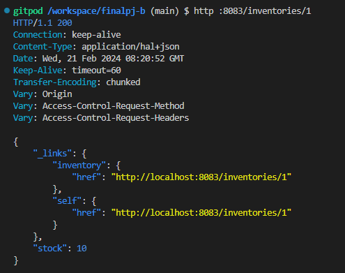

### 단일진입점

- apigateway 확인

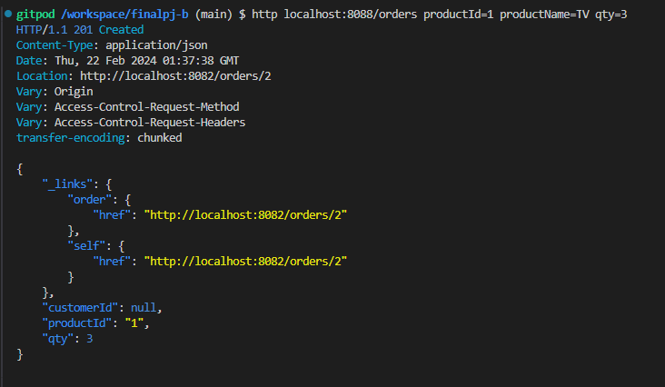

# 운영
---------------------------------------------------------------------------------------
### 클라우드 배포 - conatiner 운영

- 패키지 된 jar 파일을 기반으로 한 이미지 빌드
- 빌드 된 이미지를 docker hub repo에 push
- 이미지를 활용하여 실행

### hpa

- Pod 를 Kubernetes에서 수평적으로 확장하는 방법인 hpa 입니다.

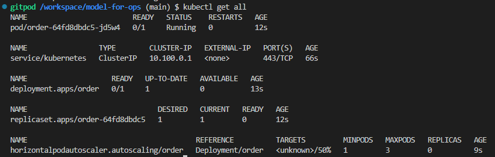

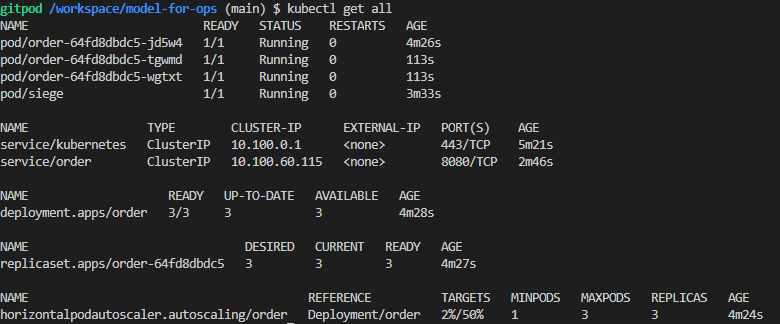

### configMap

- 컨피그맵(Configmap)은 쿠버네티스가 컨테이너에서 필요한 환경설정 내용을 컨테이너와 분리해 저장하고 제공해 주기 위해 사용한다.

```
kubectl apply -f - <<EOF
apiVersion: v1
kind: ConfigMap
metadata:
  name: config-dev
  namespace: default
data:
  ORDER_DB_URL: jdbc:mysql://mysql:3306/connectdb1?serverTimezone=Asia/Seoul&useSSL=false
  ORDER_DB_USER: myuser
  ORDER_DB_PASS: mypass
  ORDER_LOG_LEVEL: INFO
EOF
```

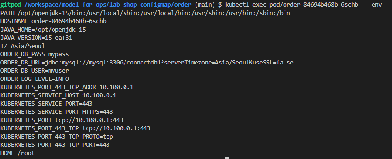

작성된 ConfigMap 의 db 정보와 동일한 것을 알 수 있다.

### PVC

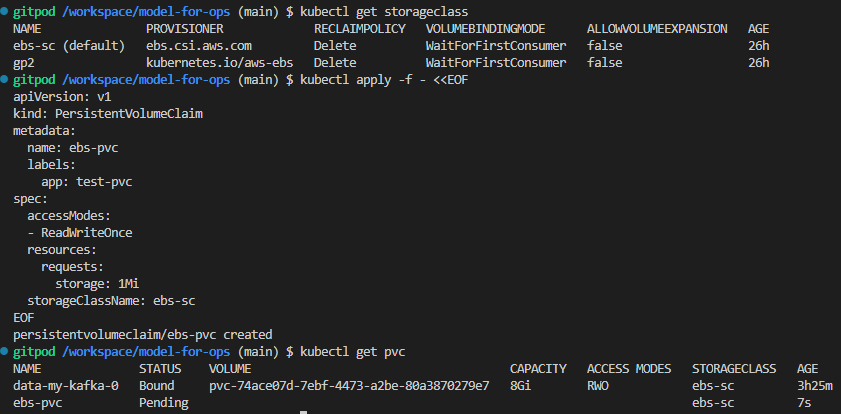

### 무정지 배포

- 클러스터에 배포를 할때 readinessProbe 설정이 없으면 다운타임이 존재 하게 된다. 
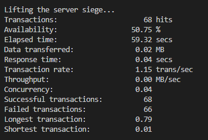

availability 50% 로 보아 50 %의 중단이 있었음

readinessPorbe 설정 추가 후
```
readinessProbe:    
            httpGet:
              path: '/orders'
              port: 8080
            initialDelaySeconds: 10
            timeoutSeconds: 2
            periodSeconds: 5
            failureThreshold: 10

```

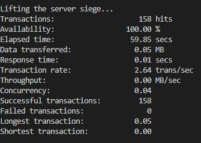

availability 100% 로 보아 50 % 모두 가동한 것을 알 수 있음


### 서비스mesh

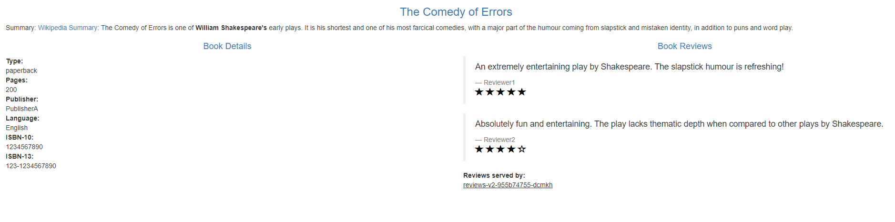

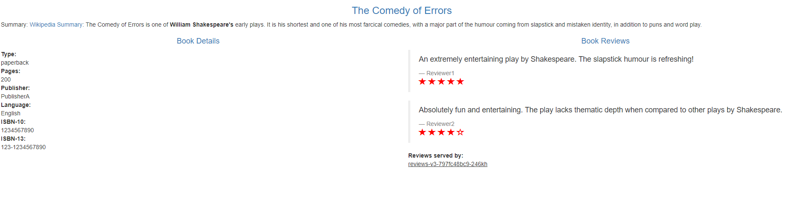
